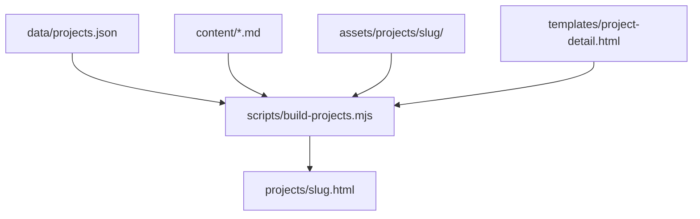

# 專案圖片指南

本網站為**靜態建置**：你編輯 JSON、Markdown 與 `assets/` 裡的圖片，執行 `npm run build` 後會產生 `projects/{slug}.html` 與首頁卡片。

## 圖片放在哪裡

每個專案一個資料夾，路徑必須與 [`data/projects.json`](../data/projects.json) 的 `slug` 一致：

```
assets/projects/{slug}/
  hero.png          ← 詳情頁頂部 Hero（建議 16:9，寬約 960px）
  card.png          ← 首頁「My Work」專案卡縮圖
  …其他檔名         ← 內文或開場圖庫用
```

**Tea Sensory Lab** 的 `slug` 是 `tea-sensory-lab`；內文 Markdown 在 `content/interactive-installation/`，但圖片仍放在 `assets/projects/tea-sensory-lab/`。

建議檔名使用英文、數字、連字號（例如 `gallery-01.png`），避免空格，可少掉 URL 編碼問題。若檔名含空格，建置腳本會自動編碼，但手動維護較麻煩。

## 三種圖片用途

| 用途 | 設定位置 | 路徑寫法 |
|------|----------|----------|
| **Hero** | `projects.json` → `hero.src` | 相對於 `projects/{slug}.html`：`../assets/projects/{slug}/hero.png` |
| **首頁卡片** | `projects.json` → `cardImage.src` | 相對於 `index.html`：`assets/projects/{slug}/card.png`（不要加 `../`） |
| **內文單張圖** | `content/.../*.md` | 同上 Hero：`../assets/projects/{slug}/檔名.png` |
| **開場圖庫（Problem 前）** | `projects.json` → `introGallery` | 同上 Hero；見下文 |

### 內文圖（Markdown）

```markdown

```

建置後會套上與內文相同的可點擊樣式，並加入 Lightbox 序列。

### 開場圖庫（Problem 前一覽、每行兩張）

在 `projects.json` 該專案下加入 `introGallery` 陣列。圖片會出現在 **Hero 下方、「The Problem」標題之前**，以 **兩欄網格** 顯示（與 `.process-images` 相同樣式：圓角、hover 光暈、可點擊放大）。

範例（Tea Sensory Lab）：

```json
"introGallery": [
  {
    "src": "../assets/projects/tea-sensory-lab/gallery-01.png",
    "alt": "Tea Sensory Lab — installation photo 1"
  },
  {
    "src": "../assets/projects/tea-sensory-lab/gallery-02.png",
    "alt": "Tea Sensory Lab — installation photo 2"
  }
]
```

- 順序即畫面上的排列順序（左到右、由上而下，每行兩張）。
- `alt` 會用於無障礙與 Lightbox。
- 手機版（寬 ≤768px）會自動改為**單欄**。

## 內文圖並排（桌面）

Problem / Process / Result 區塊中，Markdown 的 `` 會變成 `.case-content-img-wrap`（與 Hero、introGallery 不同）。

| 瀏覽器寬度 | 行為 |
|------------|------|
| **桌面**（≥769px） | 每張內文圖寬度約 **50%**；連續兩張會左右並排，三張則為兩張一行 + 第三張下一行 |
| **手機**（≤768px） | 每張 **100%** 全寬，上下排列 |

在 Markdown 裡把多張圖**寫在一起、中間不要空行**，然後執行 `npm run build`。建置腳本會把連續的 `.case-content-img-wrap` 包進 `.case-content-images`，桌面版以 flex 兩欄並排：

```markdown


```

單張內文圖在桌面約佔一半寬；兩張以上會自動並排。若日後要改為「僅多張並排、單張全寬」，可在 [`css/project-detail.css`](../css/project-detail.css) 調整 `.case-content > .case-content-img-wrap` 規則。

## 建置流程

```bash
npm install
npm run build
```

或開發時：

```bash
npm run build:watch
```

若 JSON 指向的檔案不存在，建置仍會完成，但終端機會顯示 `[warn] … missing … file` 提示。

**請勿手改** `projects/*.html`；改完 JSON / Markdown / 圖片後重新 build。

## 程式如何運作（給之後自行擴充）



1. **`build-projects.mjs`** 讀取 `projects.json`，對每個專案：
   - `hero` / `cardImage` → 產生 Hero 與首頁 ``。
   - `introGallery`（可選）→ 產生 `introGalleryHtml`：一組 `.process-images.intro-gallery` 包住多個 `.process-img-wrap`。
   - `sections.problem|process|result` → 讀取 Markdown，用 `marked` 轉 HTML，並把其中的 `` 包成 `.case-content-img-wrap`。
2. **Lightbox 順序**：`window.lbImages` 依序為 Hero（index 0）→ `introGallery` 各張 → 各 section Markdown 內的圖片。
3. **`templates/project-detail.html`** 在 Hero 與 Problem 之間插入 `{{introGalleryHtml}}`；若專案沒有 `introGallery`，該變數為空字串。
4. **樣式**在 [`css/project-detail.css`](../css/project-detail.css)：`.process-images` 為 `grid-template-columns: 1fr 1fr`；`.intro-gallery` 僅調整與 Problem 區塊的間距。

### 為新專案加入開場圖庫

1. 把圖片放進 `assets/projects/新-slug/`。
2. 在 `data/projects.json` 該專案新增 `introGallery` 陣列（路徑與 `hero` 相同，以 `../assets/...` 開頭）。
3. 設定 `hero.src`、`cardImage.src`（副檔名與實際檔案一致）。
4. 執行 `npm run build`。

其他專案若不需要開場圖庫，**不要**加 `introGallery` 欄位即可。

## Tea Sensory Lab 目前配置

| 檔案 | 用途 |
|------|------|
| `hero.png` | 詳情頁 Hero |
| `card.png` | 首頁專案卡（可換成專用縮圖，不必與 Hero 相同） |
| `Tea Sensory Lab_p2.png` … `p9.png` | `introGallery` 八張，Problem 前兩欄展示 |

若你新增第 10 張作為專用 `card.png`，只需覆蓋 `assets/projects/tea-sensory-lab/card.png` 並重新 build，無需改 `introGallery`。

## 相關檔案

- [`data/projects.json`](../data/projects.json) — 專案 metadata、hero、card、introGallery
- [`scripts/build-projects.mjs`](../scripts/build-projects.mjs) — 建置邏輯
- [`templates/project-detail.html`](../templates/project-detail.html) — 詳情頁版型
- [`css/project-detail.css`](../css/project-detail.css) — Hero、圖庫、內文圖樣式
